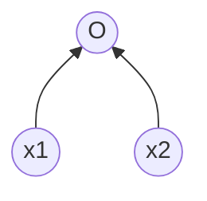
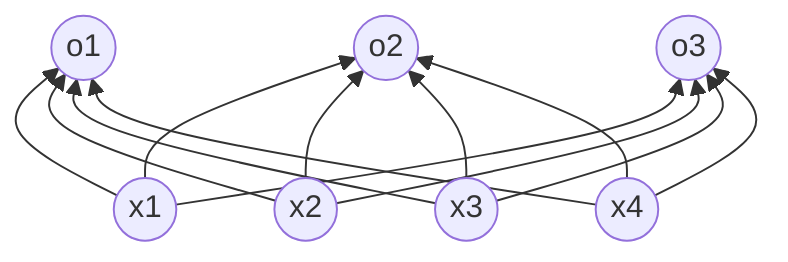

# 深度学习基础

## 监督学习与无监督学习

### 监督学习

+ 概述：事先给出分类标签
+ 两类问题：
  + 回归问题：模型为连续线性映射
  + 分类问题：模型为离散映射
    + 二分类
    + 多分类

### 无监督学习

+ 概述：机器自己寻找数据的隐藏规律或特征进行分类
+ 常用算法：聚类

### 优缺点对比

+ 监督学习对数据集要求更高，模型可能更符合需求和初衷
+ 无监督学习可挖掘意外的映射关系，结果可控性也相对较差

### 发展

+ 半监督学习
+ 弱监督学习

## 欠拟合与过拟合

### 欠拟合

+ 概述
+ 解决方案

### 过拟合

+ 概述
+ 解决方案

# 神经网络

## 基础

### 后向传播

+ 作用：对搭建的模型参数进行微调
+ 原理：复合函数求导

### 损失与优化

+ 损失
  + 概述：预测值与真实值之间的误差
  + 损失函数
    + 均方误差函数：预测值与真实值之差的平方的期望值
    + 均方根误差函数：预测值与真实值之差的平方的期望值的算术平方根
    + 平均绝对误差函数：预测值与真实值之差的绝对值的期望值
  + 梯度即为损失函数的各偏导数组成的向量
+ 优化
  + 概述：在不过拟合的情况下调整参数使优化最小
  + 组成：
    + 参数的初始化
    + 参数微调方式
    + 选取合适的学习速率
  + 一阶导数与梯度
  + 优化函数
    + 解决问题：局部最优、抖动、优化时间
    + 分类：
      + 梯度下降
      + 批量梯度下降（批量）
      + 随机梯度下降
      + 自适应Adam
  + 激活函数
    + 解决问题：适应非线性模型
    + 分类：
      + Sigmod
      + tanh
      + ReLU
    + 准则：
      + 避免梯度消失
      + 使用零中心数据

## 线性回归

### 实际问题

+ 预测连续值
+ 房屋价格、气温、销售额等连续问题

### 模型定义

+ 确定特征和权重
+ 表示==标签==关于==特征==和==模型参数==的线性关系

### 模型训练

+ 训练数据得到==预测标签==
+ 由预测标签和实际标签得到==损失函数==
+ 由==优化算法==确定==学习率==并更新==模型参数==

### 模型表示



+ O表示输出层，x1和x2表示输入层
+ 输出层和输入层各个输入完全连接时，输出层又称为全连接层或稠密层

## 卷积神经网络


## Softmax回归

### 概述

+ 模型输出为多个离散值
+ 常用示例为图像类别分类

### 描述

设：特征类别为4，输出类别为3

+ 模型输出结果为1×3的向量
+ 模型权重为12个标量，偏差为3个标量



### Softmax运算

+ 将输出值映射到[0,1]之间
+ 将一系列输出值归一化
+ 计算示例如式(1)

$$
\begin{align}
& \widehat {y}_1,\widehat {y}_2,\widehat {y}_3 \,=\, softmax(o_1,o_2,o_3) \tag{1}\\
\\
\\
y_1 = \frac {exp(o_1)}{\sum_{i=1}^3exp(o_i)} \qquad& \qquad
y_2 = \frac {exp(o_2)}{\sum_{i=1}^3exp(o_i)} \qquad \qquad
y_3 = \frac {exp(o_3)}{\sum_{i=1}^3exp(o_i)}
\end{align}
$$


# Python类

## 概述

+ class关键字后跟类名
+ 创建实例不需要new关键字
+ 类中方法的定义必须有self参数，调用时可不需要传入
+ self指代类的实例，类中引用实例变量格式为self.xxx
+ self.\__class__指代类本身

## 构造函数

+ \__init__(self,...):

## 继承与重写

+ 派生类——子类，基类——父类

+ ```python
  class DerivedClassName(modname.BaseClassName):  #继承写法
  ```

+ ```python
  class sample(speaker,student):     #多继承
  ```

+ ```python
  class Child(Parent):
  	...
  	
  c = Child()          # 子类实例
  c.myMethod()         # 子类调用重写方法
  super(Child,c).myMethod() #用子类对象调用父类已被覆盖的方法
  ```

  

## 类专有方法

+ **__init__ :** 构造函数，在生成对象时调用
+ **__del__ :** 析构函数，释放对象时使用
+ **__repr__ :** 打印，转换
+ **__setitem__ :** 按照索引赋值
+ **__getitem__:** 按照索引获取值
+ **__len__:** 获得长度
+ **__cmp__:** 比较运算
+ **__call__:** 函数调用
+ **__add__:** 加运算
+ **__sub__:** 减运算
+ **__mul__:** 乘运算
+ **__truediv__:** 除运算
+ **__mod__:** 求余运算
+ **__pow__:** 乘方

## 类相关函数

+ super()：用于调用父类（超类）的方法

## 对象销毁与回收

+ continue...

## 私有属性与私有方法

+ 私有变量和私有方法都以__（两个下划线）开头
+ 外部实例不能访问私有变量和方法

# Python补充

+ random.shuffle(indexs)：随机排列列表indices
+ np.random.normal()：生成正态分布数据列
+ plt.scatter()：绘制散点图
+ Tensor.index_select()：按照tenosr索引行或列，0索引行，1索引列
+ yield关键字：生成器返回结果
+ 生成器与迭代器*：
+ item()：索引精度更高


