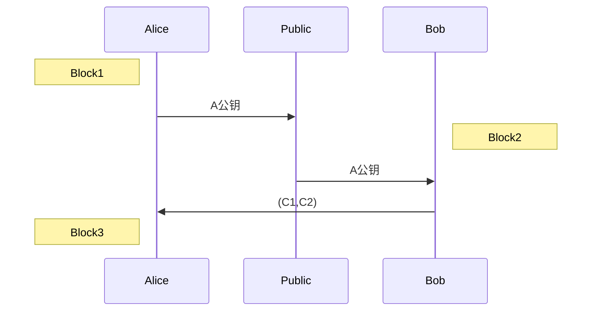
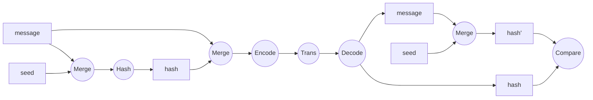
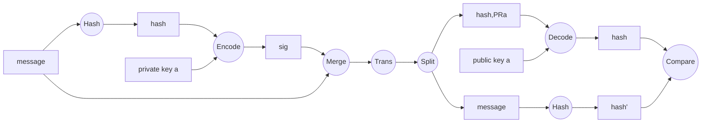

# 公钥密码学

## 数学基础

### 因子

+ 描述：
  + b|a表示b整除a，即b为a的一个因子
+ 性质：
  + 若b|a且a|b，则有a=±b
  + 任何数a有a|0

### 素数

+ 描述：
  + 因子只有1和本身的数
+ 定理：
  + 任何大于1的数都可以分解为素数的幂乘形式
  + 任何大于1的数都可以由所有素数的集合的指数表示 
  + a|b $\rightarrow$ a~p~ <= b~p~ 
+ 最大公因子（非负）
  + 表示：gcd(a,b)
  + gcd(a,0) = 0
+ 互素
  + 当gcd(a,b) = 1时，则a和b互素

### 模运算

+ 描述：a mod n 或 a % n
+ 等价等式： a = $\lfloor a/n \rfloor$×n + a mod n 

### 模指数运算

+ 将指数表示为二进制数，得到2倍率关系
+ 运用同模乘法运算性质拆分递归

### 同模

+ 描述：若a mon n = b mod n，则有 a $\equiv$ b (mod n)
+ 性质：
  + 若n|(a-b)，则有 a $\equiv$ b (mod n)
  + 若a $\equiv$ b (mod n)，b$\equiv$ c (mod n)，则有a $\equiv$ c (mod n)
+ 运算性质：
  + (a+b) mod n = [(a mod n) + (b mod n)] mod n
  + (a - b) mod n = [(a mod n) - (b mod n)] mod n
  + (a×b) mod n = [(a mod n) × (b mod n)] mod n
+ ==扩展==：
  + (m mod p)^2^ mod p = m^2^ mod p
  + 若 a $\equiv$ b (mod n)，则有 a^2^ $\equiv$ b^2^ (mod n)
  + 若a $\equiv$ b (mod n)，则有 ka $\equiv$ kb (mod n)
  + 若a $\equiv$ b (mod n)，则有 a = kn + b

### 乘法逆元

+ 描述：ed $\equiv$ 1 (mod m)，满足gcd(e,m) = 1，则称e、d关于模m互为乘法逆元
+ 求解逆元：e,m $\Longrightarrow$ d

## 定理

### 大整数分解

+ 素因子分解为素因子的幂乘形式

### 费尔马定理

+ a^(p-1)^ $\equiv$ 1 (mod p)  需满足p为素数

### 欧拉定理

+ 欧拉函数：$\phi$ (n) $\rightarrow$小于n且与n互素的正整数个数
+ 补充：如果一个数n可分解为两个素数p,q，则$\phi$ (n) = (p-1)(q-1)
+ 欧拉定理：对任意的a,n满足gcd(a,n) = 1 $\rightarrow$ a^$\phi$ (n)  $\equiv$  1 (mod n) 

### 欧几里得算法

+ 也称辗转相除法，求最大公约数

+ 引理：gcd(a,b) = gcd(b,a mod b)


### 扩展欧几里得算法

+ 问题：形如ax+by=z(a,b均不为0，且a,b,z均为整数)，求x,y整数解
+ 引理：裴蜀定理 若ax+by=z有整数解 则gcd(a,b)|z

+ 扩展欧几里得（二元一次方程通解）：ExGcd，求乘法逆元

### 离散对数

+ 求x以满足y  $\equiv$  g^x^ (mod p)，可写作x  $\equiv$  log~g~ y (mod p)
+ 若g是p的本原根，则x一定存在，否则不一定存在

### 本原根

+ a^m^ $\equiv$ 1 (mod n), gcd(a,n) = 1
  + 根据欧拉定理可得一定存在，m = $\phi$ (n) 
  + 最小的m为a的阶
+ 描述：数a的阶为 $\phi$ (n)，则称a为n的本原根
+ 性质：若p是素数，a是p的本原根，则有： a^1^ , a^2^ , ... , a^p-1^ 是模p各不相同的

## RSA

### 概述

+ 乘方运算时间复杂度小，容易计算
+ 素因子分解困难计算

### 流程

+ 任选两个素数p和q
+ 计算n=pq，$\phi$ (n) = (p-1)(q-1)
+ 随机选择e，满足1<e<$\phi$ (n)且gcd(e,$\phi$ (n)) = 1，由(e,n)组成公钥
+ 求解同余方程，ed $\equiv$ 1 (mod$\phi$ (n)) 且 0$\leq$d$\leq$n，由(d,n)组成私钥

### 安全性参数*

### 攻击RSA

+ 穷举搜索
+ 数学攻击
+ 计时攻击（基于解密的运行情况）
+ 选择密文攻击

### 习题——待做


# DH交换

### 概述

+ 密钥分配方案，用于密钥建立
+ 不能用于交换大量信息
+ 只对通信双方已知

### 原理

+ 离散对数问题

### 交换流程

+ 全局参数：大素数q和模q的本原根$\alpha$

  ```mermaid
  sequenceDiagram
  	Note left of Alice:Block1
  	Alice ->> Bob:Ya
  	Note right of Bob:Block2
  	Bob ->> Alice:Yb
  	Note left of Alice:Block3
  ```

+ Block1: random X~a~ < q; Y~a~ = $\alpha$^Xa^ mod q
+ Block2: random X~b~ < q; Y~b~ = $\alpha$^Xb^ mod q; K = Y~a~^Xb^ mod q
+ Block3: K = Y~b~^Xa^ mod q

### 安全性

+ K为Alice和Bob两个用户的共享密钥
+ 攻击者求解x，须求解离散对数

### 密钥交换

+ 分类
  + 暂态DH
  + 固定DH
+ 缺陷
  + 无法抵御中间人攻击
+ 原因
  + 缺少消息认证


# ElGamal密码体系

## 原理

+ 基于离散对数问题
+ 类似DH密钥协商协议

## 算法流程

+ 全局假设：Bob向Alice发送信息



+ Block1: 
  + Alice选择一个素数q，得到q的一个本原根$\alpha$
  + 产生一个Xa $\in$ (1, q-1)，计算Ya = $\alpha$^Xa^ mod q
  + A的私钥为Xa，公钥为{q, $\alpha$, Ya}交由可信公开中心Public保管
+ Block2:
  + Bob去可信公开中心Public获得A的公钥，准备发送的明文M $\in$ [1, q-1]
  + 随机产生一个整数k $\in$ [1, q-1]，计算K = Ya^k^ mod q
  + 计算C~1~ = $\alpha$^k^ mod q和C~2~ = K*M mod q，得到最终密文(C~1~,C~2~)
+ Block3:
  + Alice计算得到K = C~1~^Xa^ mod q
  + 求解K关于模q的乘法逆元K^-1^ 
  + 计算得到明文M = (C~2~ K^-1^) mod q

## 安全性

+ 安全性依赖于Zp*上的离散对数问题
+ 加密过程，不同消息m需要选取不同随机数k

## 攻击举例

+ 假设k用于多个明文加密，并且其中一次明文M~1~已知，计算其余明文M~2~ 相对容易

1. 对应M~1~有C~11~ = $\alpha$^k^ mod q，C~12~ = K\*M~1~ mod qM~2~有C~21~ = $\alpha$^k^ mod q，C~22~ = K*M~2~ mod q

2. 容易得到
   $$
   \frac {C_{12}}{C_{22}} = \frac {M_1\,mod\,q}{M_2\,mod\,q}
   $$

3. 则有 M~2~ =  (C~12~)^-1^ *C~22~ *M~1~ mod q

## 缺陷

+ 需生成一系列不同随机数
+ 密文长度加倍，冗余导致传输效率下降


# ECC密码体系

## 优势

+ 较小长度密钥便可达到较高计算难度

## 原理

+ 椭圆曲线：y^2^ + axy + by = x^3^ + cx^2^ + dx + e

+ 点加法：P + Q = R，过P和Q的直线与椭圆曲线相交的第三点的x轴对称点

+ 求椭圆曲线上的点集E~p~ (a,b)，椭圆曲线等式两边同模p运算

+ 加法法则：( P,Q $\in$ E~p~ (a,b) )

  + P + O = P

  + P = (x, y)，那么-P = (x, -y)是P的加法逆元，有P + (-P) = 0

  + P = (x~1~, y~1~)，Q = (x~2~, y~2~)，P $\neq$ -Q，则P + Q = (x~3~, y~3~)

    + x~3~ $\equiv$ $\lambda$^2^ - x~1~ - x~2~ (mod p)

    + y~3~ $\equiv$ $\lambda$(x~1~ - x~3~) - y~1~ (mod p)

    + 其中$\lambda$为
      $$
      \lambda = 
      	\begin{cases} 
      	&\frac {y_2 - y_1}{x_2 - x_1}, & P\neq Q\\
      	&\frac {3x_1^2 + a}{2y_1}, & P= Q
      	\end{cases}
      $$

  + ECDLP（EC上的离散对数问题）：Q = kP

    已知P和Q，k的计算是困难的，而已知P和k，Q的计算是容易的

  

## 算法流程

### 密钥交换

y = x^3^ + ax + b (mod p)  

1. 选择素数p(160+ byte)和参数a、b

2. 选择一个生成点G(x~1~ , y~1~)

3. A：选取秘密的数r~a~，计算P~a~ = r~a~G

   B：选取秘密的数r~b~，计算P~b~ = r~b~G

4. 交换P~a~和P~b~

5. A：计算K = r~a~P~b~ = r~a~r~b~G

   B：计算K = r~b~P~a~ = r~b~r~a~G

p、a、b、点G 是全局公开参数

### 加解密

y = x^3^ + ax + b (mod p)  

1. 初始化p、a、b、点G、A的私钥r~a~和公钥P~a~ 、B的私钥r~b~和公钥P~b~

2. A加密消息发送到B：

   ​	明文m的编码点P~m~，选择随机数k，密文

   ​	C = {C~1~,C~2~} = {kG, P~m~ + kP~b~}

3. B解密：

   ​	编码点P~m~ = C~2~ - r~b~C~1~ = P~m~ + kP~b~ -  r~b~kG =  P~m~ + kr~b~G -  r~b~kG = P~m~


## 评估

+ 密钥长度相等情况下，RSA和ECC速度相当
+ 相同安全强度下，ECC可以使用较少位数

## 应用场景

+ 密钥交换
+ 加密解密


# Hash函数

## 描述

+ 一类特殊的单向函数

## 要求y = H(x)

+ x压缩成固定长度比特串y
+ 不同的x生成不同的y（可能会碰撞）
+ 由y的值无法反推x的值

## 应用

### 消息认证

+ 加密全文本：加密文本和Hash值
+ 加密Hash：仅加密Hash值
+ 随机数Hash：Hash值由文本外加一个随机数得出
+ 随机数Hash后加密：加密随机数Hash和文本



### 数字签名

+ 签名



+ 加密全文本：Merge后使用共享密钥加密整个文本，再进行传输，接收方获得报文后，先使用共享密钥解密，再进行之后的操作。

### 其他

+ 从口令衍生密钥
+ 产生随机数
+ 给明文增加结构特征保护密文*
+ 挑战-应答认证协议*

## 基本性质

+ 单向性
+ 抗碰撞性：找不到不同x对应相同y

## 安全性要求

+ 输入任意，输出固定长度比特
+ 计算效率高
+ 单向性
+ 弱抗碰撞特性：给定找出碰撞
+ 强抗碰撞特性：找出任意一对碰撞
+ 伪随机性

关系：强抗碰撞特性 $\subseteq$ 弱抗碰撞特性，单向性与前两者均有相交

## 攻击

+ 找碰撞：生日攻击


